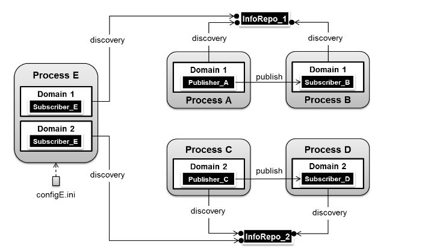

# CHAPTER 7

### Run-time Configuration

## 7.1 動手設定

OpenDDS使用以檔案為基礎的設定框架，其中包含全預選項，與特定發布者、訂閱者相關的選項(如探索設定以及傳送設定)。
OpenDDS也允許使用者透過執行文字指令，部份的選項可以透過API設定。
這個章節將會描述OpenDDS支援的設定選項。
* 一般設定選項：
設定在全域等級下DCPS實體的行為。
這將可以讓在相同電腦環境下部署的不同進程共享同一個一般設定。
(例如所有的讀取者及寫入者都使用RTPS探索)
* 探索設定選項：
探索設定機制下的行為。
OpenDDS支援多種探索途徑及協調寫入者與讀取者。
更多細節參照段落7.3。
* 傳送設定選項：
設定可擴展傳送框架(ETF)，作為OpenDDS的DCPS層中的抽象傳輸層。
每個可插拔式的傳送都可以被分別設定。

OpenDDS的設定檔案為易讀的ini格式文字檔。 表7-1為可允許的設定段落類型，他們都對應一種OpenDDS設定選項。

#### 表7-1 設定檔案段落

| 設定選項類型 | 檔案段落標題                                                                      |
|-----------------|-----------------------------------------------------------------------------------|
| 全域設定         | [common]                                                                          |
| 探索            | [domain] [repository] [rtps_discovery]                                            |
| 靜態探索        | [endpoint] [topic] [datawriterqos] [datareaderqos] [publisherqos] [subscriberqos] |
| 傳送            | [config] [transport]                                                              |


除了[common]之外，每個段落得標頭都可以用[段落標題/實例]的格式作設定，舉個例子，[repository]標頭可以這樣描述：
[repository/repo_1]，repository為段落標題，repo_1為實例名稱，這個標頭下的設定將套用在repo_1實例下的repository設定。
如何使用實例來設定探索以及傳送選項將會在段落7.3以及7.4介紹。

`-DCPSConfigFile` 指令參數可以用來傳遞欲套用之OpenDDS設定檔案的位置。如下：

Windows：
```shell
publisher -DCPSConfigFile pub.ini
```
Unix：
```shell
./publisher -DCPSConfigFile pub.ini
```
指令參數將在domain參與因數(domain participant factory)初始化時傳遞至個別參與的實例。
這將由巨集`TheParticipanFactoryWithArgs`：
```cpp
#include <dds/DCPS/Service_Participant.h>
int main (int argc, char* argv[])
{
  DDS::DomainParticipantFactory_var dpf =
  TheParticipantFactoryWithArgs(argc, argv)
```
`Service_Participant`集合也提供允許應用程式設定DDS服務的方法，詳情參照標頭檔`$DDS_ROOT/dds/DCPS/Service_Participant.h`。
以下段落將詳細描述各個不同的設定檔案段落以及相關的可用選項。


## 7.2 一般設定選項
OpenDDS設定檔案中的[common]段落包含的選項像是除錯訊息輸出等級、DCPSInfoRepo進程位置以及預分配記憶體設定。下面為[common]設定範例：
```
[common]
DCPSDebugLevel=0
DCPSInfoRepo=localhost:12345
DCPSLivelinessFactor=80
DCPSChunks=20
DCPSChunksAssociationMultiplier=10
DCPSBitLookupDurationMsec=2000
DCPSPendingTimeout=30
```

並不是必須指定每個選項的設定值。

[common]中的設定值若名稱以"DCPS"作開頭的皆可被指令列參數覆蓋。
指令列參數名稱和設定檔中名稱相同，只是前面多了個"-"符號，例如：
```shell
subscriber -DCPSInfoRepo localhost:12345
```
下表描述[common]設定選項：

#### 表7-2 一般設定選項

| 選項名稱                                                                                                        | 敘述                                                                                                                                                                                                                                                                  | 預設值                                                  |
|-----------------------------------------------------------------------------------------------------------------|-----------------------------------------------------------------------------------------------------------------------------------------------------------------------------------------------------------------------------------------------------------------------|---------------------------------------------------------|
| DCPSBit=[1\|0]                                                                                                   | 切換內建主題支援。                                                                                                                                                                                                                                                    | 1                                                       |
| DCPSBitLookupDurationMsec=msec                                                                                  | 框架等待當解讀實例控制所給的BIT data時遣在內建主題資訊的最長持續時間(單位：毫秒)。在框架取得且處理相關BIT資訊前，參與的程式碼會獲得一個給遠端實體的實例控制。框架將會在時間內等待，之後才提示操作失敗。                                                               | 2000                                                    |
| DCPSBitTransportIPAddress=addr                                                                                  | 內建主題之IP位置，用來識別tcp傳送將用到的本地端界面。 注意：這個屬性只對DCPSInfoRepo設定有效。                                                                                                                                                                        | INADDR_ANY                                              |
| DCPSBitTransportPort=port                                                                                       | 內建主題在TCP傳送中使用的端口。如果預設值'0'已經被使用，作業系統會自己挑別的端口來使用。 注意：這個屬性只對DCPSInfoRepo設定有效。                                                                                                                                     | 0                                                       |
| DCPSChunks=n                                                                                                    | 當`RESOURCE_LIMITS`Qos值為無限時，資料讀寫快取分配之可設定DCPSChunks數量會得到預先分配之快取。當所有DCPSChunks都被分配出去時，OpenDDS將會由heap再分配。                                                                                                                           | 20                                                      |
| DCPSChunkAssociationMultiplier=n                                                                                | DCPSChunks的多工器或是藉由resource_limits.max_samples數值判斷預分配之DCPSChunks淺複製總數。將這個值設的比連接數量還大以防止預分配DCPSChunks過少。一個取樣寫入到多個資料讀取者不會執行多次完整複製而是只複製其開頭位址。這個動作佔用空間並不大，所以不需要把這個值設的太接近連結數量。 | 10                                                      |
| DCPSDebugLevel=n                                                                                                | 一個0到10的整數，用以控制除錯訊息印出的數量。                                                                                                                                                                                                                         | 0                                                       |
| DCPSDefaultAddress                                                                                              | 預設值為傳送實例包含的`local_address`，只有在設定值不為空且沒有`local_address`在傳送中被指定時生效。                                                                                                                                                                  |                                                         |
| DCPSDefaultDiscovery=[,DEFAULT_REPO\|,DEFAULT_RTPS\|,DEFAULT_STATIC\|,user-defined configuration instance name] | 在無明確設定之domain中指定Discovery設定。`Default_REPO`將使用DCPSInfoRepo，`Default_RTPS`指定於Discovery部份之RTPS使用。`Default_STATIC`設定靜態Discovery之使用。細節請參見段落7.3。                                                                                                   | DEFAULT_REPO                                            |
| DCPSGlobalTransportConfig=name                                                                                  | 指定全域設定中的傳送設定名稱。這個設定將被所有沒有另外指定傳送設定之實體使用。$file中特殊的數值使用包含設定檔中所有被定義的實體的傳送設定。                                                                                                                           | The default configuration is used as described in 7.4.1 |
| DCPSInfoRepo=objref                                                                                             | 物件指向DCPS資訊來源之位置。這可以是一個完整的CORBA IOR或是簡單的`host:port`字串                                                                                                                                                                                      | file://repo.ior                                         |
| DCPSLivelinessFactor=n                                                                                          | 當訊息送出時，最少的有效時間百分比。數值80等於20%最後一個有效訊息之潛在緩衝。                                                                                                                                                                                         | 80                                                      |
| DCPSPendingTimeout=sec                                                                                          | 一個資料寫入動作會封鎖一個刪除動作中未送出之樣品流失，其封鎖之最長持續時間。此數值之預設值為永久封鎖。                                                                                                                                                                | 0                                                       |
| DCPSPersistentDataDir=path                                                                                      | 持久資料將會儲存之檔案系統路徑。如果目錄不存在的話目錄將會被自動創建。                                                                                                                                                                                                | OpenDDS-durable-data-dir                                |
| DCPSPublisherContentFilter=[1\|0]                                                                               | 控制過濾內容Topic之過濾表達式的判斷策略。當允許(1)時，發布者可能會丟失幾個樣品，當這些樣品被訂閱者忽略時，他們不會在傳送中被處理。                                                                                                                                     | 1                                                       |
| DCPSRTISerialization=[0\|1]                                                                                     | 當整合了使用RTPS傳送之RTI實體，控制是否使用非標準序列填充。                                                                                                                                                                                                           | 0                                                       |
| DCPSTransportDebugLevel=n                                                                                       | 為一0到5之整數決定傳送日誌之訊息量。                                                                                                                                                                                                                                  | 0                                                       |
| pool_size=n_bytes                                                                                               | 安全配置文件記憶體池大小，使用bytes。                                                                                                                                                                                                                                 | 41943040 (40 MB)                                        |
| pool_granularity=n_bytes                                                                                        | 安全配置文件記憶體數量，使用bytes且必須為8的倍數。                                                                                                                                                                                                                    | 8                                                       |
| Scheduler=[,SCHED_RR\|,SCHED_FIFO\|,SCHED_OTHER]                                                                | 選擇要使用的執行序之排程。在大多數系統中設定排成為其他值需要特權。可以設置為`SCHED_RR`、`SCHED_FIFO`、`SCHED_OTHER`。`SCHED_OTHER`為大部份系統之預設值。`SCHED_RR`為知更鳥排程演算法，`SCHED_FIFO`允許各個執行序執行直到其遭到封鎖或是在被換到其他執行序前完成。      | SCHED_OTHER                                             |
| scheduler_slice=usec                                                                                            | 某些作業系統如SunOS需要設定時間片段值當選擇非預設之排程。這個選項單位為微秒。                                                                                                                                                                                         | none                                                    |
| DCPSBidirGIOP=[0\|1]                                                                                            | 與DCPSInfoRepo互動時使用TAO’s BiDirectional GIOP功能。在允許BiDir時，因為相同的接口可以供客戶端以及伺服端同時，所以很少接口會被需要。                                                                                                                                 | 1                                                       |


DCPSInfoRepo設定值將被傳送至`CORBA::ORB::string_to_object()`且為可被TAO理解的任何類型的物件位址(檔案、corbaloc、corbaname)。
一個可被接受的簡單的終端描述格式為`(host):(port)`。這和`corbaloc::(host):(port)/DCPSInfoRepo`是一樣的。

當`RESOURCE_LIMITS`被設為無限時，`DCPSChunks`選項允許開發者調配記憶體被預配置的數量。
一旦系統的記憶體配置短缺時，heap中額外的DCPSChunks可能被收回/重新配置。
這個功能提供了相當的彈性但在記憶體短缺時會影響效能。

## 7.3 探索設定

在DDS實現中，參與者會在應用程式進程中成為實例且找到同樣參與其中的對方進行溝通。
一個DDS的實現中，兩個在相同domain的DDS參與者所交換的資料會由DDS的功能來給資料的內文。
在一個DDS應用程式中，參與者會被指派到一個domain且需要確定他們設定允許其他在相同domain的參與者能找到自己。

OpenDDS提供一個集中的探索機制、一個點對點的探索機制以及靜態的探索機制。
集中的機制使用在DCPSInfoRepo進程中的分離服務。
RTPS點對點機制使用DDSI-RTPS探索協定標準實現非集中式之探索。
靜態探索機制使用設定檔決定哪些讀者與寫者應該連結起來，以及使用底層傳送決定哪個讀者或是寫者存在。
DDS應用程式的部署會需要數個設定選項存在。
除了靜態探索之外，每個機制會在沒有提供指令或是檔案設定時使用預設值。
接下來的段落會介紹如何進階配置探索設定。
舉個例子，有些部署也許會需要多個DCPSInfoRepo服務或是DDSI_RTPS探索來滿足互通需求。

### Domain設定

OpenDDS設定檔使用`[domain]`段落設定一個或多個探索domain，且每個domain指向相同檔案中的探索設定或是預設設定。
OpenDDS應用程式可以使用集中式的探索機制或是點對點的探索機制。前者為DCPSInfoRepo服務提供，後者為RTPS Discovery協定標準或是在相同部署中兩者的結合提供。

DCPSInfoRepo方法的設定在[repository]段落中，而RTPS探索設定在[rtps_discovery]段落中。
靜態Discovery機制並沒有特別的段落做設定用，不過使用者可以參考`DEFAULT_STATIC`實例。每個domain只能參考一種Discovery設定段落。

參考段落7.3.2關於設定[repository]段落，7.3.3關於設定[rtps_discovery]以及7.3.4關於設定靜態Discovery>

最後有兩種方式可以指派一整數給domain，一種是直接設實例的數值為該整數，如下：
```
[domain/1]
DiscoveryConfig=DiscoveryConfig1
(more properties...)
```
這個範例設定一個由domain關鍵字識別之domain且加上了實例數值/1。在斜線後的實例數值將指派給domain。也可以用字串代替整數，如下
```
[domain/books]
DomainId=1
DiscoveryConfig=DoscoveryConfig1
```

domain給指定了個比較可識別的名稱，`DomainId`屬性則指派了DDS應用程式讀取設定所需的整數。多個domain實體可以被單一個此格式的設定檔識別。
一旦一個或多個實例被建立，探索屬性必須被該domain識別。`DiscoveryConfig`屬性必須指向另一個持有探索設定之段落或是指定其中一個內部預設的探索數值(如`DEFAULT_REPO`、`DEFAULT_RTPS`、`DEFAULT_STATIC`)。範例中的實體名稱為`Discovery_Config1`。
這個實例的名稱必須和[repository]或是[rtps_discovery]中的敘述連結，如下：
```
[domain/1]
DiscoveryConfig=DiscoveryConfig1
[repository/DiscoveryConfig1]
RepositoryIor=host1.mydomain.com:12345
```
這裡我們的domain指向了使用DCPSInfoRepo服務的[repository]段落，詳情參照7.3.2。
當特定的domain不被設定檔識別，例如，如果OpenDDS應用程式指派了domain ID 3給了他的參與者且上面例子沒有提供domain設定，可以像下面這樣使用：
```
[common]
DCPSInfoRepo=host3.mydomain.com:12345
DCPSDefaultDiscovery=DEFAULT_REPO
[domain/1]
DiscoveryConfig=DiscoveryConfig1
[repository/DiscoveryConfig1]
RepositoryIor=host1.mydomain.com:12345
```

`DCPSDefaultDiscovery`屬性告訴應用程式指派任何沒能從設定黨獲取domain id的參與者使用Default_Repo，且DCPSInfoRepo服務可以在host3.mydomain.com:12345被找到。在表7-2中`DCPSDefaultDiscovery`屬性有另外兩個值可以被使用，分別是DEFAULT_RTPS和DEFAULT_STATIC。
最後一個在DCPSDefaultDiscovery屬性中的選項告訴應用程式使用其中一種已定義的探索設定作為所有不是從檔案中獲取設定值的參與者的預設設定，如下：
```
[common]
DCPSDefaultDiscovery=DiscoveryConfig2
[domain/1]
DiscoveryConfig=DiscoveryConfig1
[repository/DiscoveryConfig1]
RepositoryIor=host1.mydomain.com:12345
[domain/2]
DiscoveryConfig=DiscoveryConfig2
[repository/DiscoveryConfig2]
RepositoryIor=host2.mydomain.com:12345
```
加入`DCPSDefaultDiscovery`屬性到[common]段落，沒有特別指派設定的參與者將會使用DiscoveryConfig2。更多細節參考段落7.3.3。
以下為[domain]段落中可用的屬性。

#### 表7-3 Domain段落設定屬性

| 選項                                 | 敘述                                                                                                                                       |
|--------------------------------------|--------------------------------------------------------------------------------------------------------------------------------------------|
| DomainId=n                           | 一個代表正與repository關聯之domain的整數                                                                                                   |
| DomainRepoKey=k                      | 映射repository之鍵值。 (已經無效了，只提供過去版本相容)                                                                                    |
| DiscoveryConfig=config instance name | 使用者定義之字串，提交到同一設定檔中的[repository]或是[rtps_discovery]中的實例名稱或是預設值(DEFAULT_REPO、DEFAULT_RTPS和DEFAULT_STATIC)。 |
| DefaultTransportConfig=config        | 使用者定義字串，提交到[config]中的實例名稱。                                                                                               |

### 7.3.2 應用程式對DCPSInfoRepo設定
OpenDDS中的DCPSInfoRepo是一個在本地端或是遠端節點運作，為參與者提供探索服務。
參與者該如何透過修改設定找到DCPSInfoRepo將會是本節重點。
舉個例子，DCPSInfoRepo服務在`myhost.mydomain.com:12345`上啟動，應用程式可以透過指令參數或是讀取設定檔來讓他們的OpenDDS參與者知道如何找到這服務。
在2.1.7中我們提到如何用指令傳遞參數來找到DCPSInfoRepo，如下：
```shell
publisher -DCPSInfoRepo file://repo.ior
```
假設DCPSInfoRepo已經以下列指令啟動了：

Windows：
```shell
%DDS_ROOT%\bin\DCPSInfoRepo -o repo.ior
```
Unix：
```shell
$DDS_ROOT/bin/DCPSInfoRepo -o repo.ior
```

DCPSInfoRepo服務會在此檔案產生他的位置物件資訊且參與者會需要讀此檔案以取得最終連線。
IOR檔案可以用來找探索服務，然而在大部份的作業環境下並不實際，所以應用程式可以改用指令來指向DCPSInfoRepo，如下：
```
publisher -DCPSInfoRepo myhost.mydomain.com:12345
```
接下來假設DCPSInfoRepo用下列指令啟動了：

Windows：
```
%DDS_ROOT%\bin\DCPSInfoRepo -ORBListenEndpoints iiop://:12345
```
Unix：
```
$DDS_ROOT/bin/DCPSInfoRepo -ORBListenEndpoints iiop://:12345
```

如果應用程式需要使用設定檔做其他設定，無論是修改設定檔還是下指令都會更方便。
設定檔的用法也同時了多個應用程式進程共享OpenDDS設定。下面是將設定移到[common]中的設定檔案(pub.ini)：
```
[common]
DCPSInfoRepo=myhost.mydomain.com:12345
```
如果是指令的話是這樣：
```
publisher -DCSPConfigFile pub.ini
```
根據範例，一個設定檔會指定discovery設定指定的domain，所以`RepositoryIor`屬性可以用來取得指令列所提供相同的訊息來指向一個正在運行的DCPSInfoRepo服務。以下是兩個domain時的設定：
```
[domain/1]
DiscoveryConfig=DiscoveryConfig1
[repository/DiscoveryConfig1]
RepositoryIor=myhost.mydomain.com:12345
[domain/2]
DiscoveryConfig=DiscoveryConfig2
[repository/DiscoveryConfig2]
RepositoryIor=host2.mydomain.com:12345
```
在[domain/1]中的`Discovery`引導所有參與者到domain 1以使用實例中叫DiscoveryConfig1的設定。
然後引導到[repository]段落並給了`myhost.mydomain.com:12345`的`RepositoryIor`值。
```
[common]
DCPSInfoRepo=localhost:12345
[domain/1]
DiscoveryConfig=DiscoveryConfig1
[repository/DiscoveryConfig1]
RepositoryIor=myhost.mydomain.com:12345
[domain/2]
DiscoveryConfig=DEFAULT_REPO
```
這裡參與者在domain2會參照[common]中的DCPSInfoRepo受到引導。如果[common]中沒有DCPSInfoRepo值，他將會改參照指令參數如下：
```
publisher -DCPSInfoRepo localhost:12345 -DCPSConfigFile pub.ini
```
如果DCPSInfoRepo在設定黨或是指令中皆未定義，預設值為`file:///repo.ior`。

### 7.3.2.1 多個DCPSInfoRepo實例設定

單一OpenDDS進程中的DDS實體可以和多個DCPSInfoRepo連結。
容器的資訊和domain的連結可以透過設定檔和應用程式API來做設定。
內部預設值、指令參數或是設定檔內的選項在現在不想要使用多個DCPSInfoRepo連結的應用程式可以正常運作。

根據圖7-1的進程範例，其中使用了多個DCPSInfoRepo容器。
進程A和B應用程式進程已經經過設定會和另一個進程溝通且在InfoRepo_1中探索到對方。
這是探索基本的用途。
然而，額外的內文層在特定的domain(Domain 1)已經被套用了。
DDS實體(資料讀/寫者)都被限制只能在相同的domain內進行溝通。
這會在應用程式需要時提供一個有效分離流量的方法。
進程C和D是用一樣的方法設定的，但由Domain 2操作且使用InfoRepo_2。
當你有需要多個domain和分離的探索服務時會比較麻煩。
以進程E為例，他包含了兩個訂閱者，一個訂閱InfoRepo_1中的推播而另一個訂閱InfoRepo_2中的推播。
實現這功能的設定檔為configE.ini。



*圖7-1 多DCPSInfoRepo設定*

現在我們來看看設定檔(configE.ini)並演示進程E如何同時與兩個domain溝通且分離DCPSInfoRepo服務。
在這個範例中我們只討論探索的部份而忽略傳送內容。
*configE.ini*
```
[domain/1]
DiscoveryConfig=DiscoveryConfig1
[repository/DiscoveryConfig1]
RepositoryIor=host1.mydomain.com:12345
[domain/2]
DiscoveryConfig=DiscoveryConfig2
[repository/DiscoveryConfig2]
RepositoryIor=host2.mydomain.com:12345
```
如圖7-1，當進程E讀取上面設定時會發現多個domain段落事件。
如描述每個domain有一個實例整數以及一個關於DiscoveryConfig定義的屬性。
在第一個domain`[domain/1]`，使用者所定義的DiscoverConfig1之值提供DiscoveryConfig屬性。
這個屬性會造成OpenDDS的運作會去找到一個段落標題，又或是容器或rtps_discovery以及實例名稱DiscoveryConfig1。
在此範例中，`[repository/DiscoveryConfig1]`會被找到且變成此domain實例`[domain/1]`的探索設定。
從以上動作我們可以知道此domain的DCPSInfoRepo位址應該使用RepositoryIor屬性值來尋找。
實際上這是`host1.mydomain.com`且port為12345。
`RepositoryIor`的值可能唯一完整的CORBA IOR或是簡單的(host):(port)字串。


第二個domain段落標題`[domain/2]`可以在設定檔裡面找到，並且對應到[repository/DiscoveryConfig2]。
他們可以是單一設定檔案中的任何容器的數字或是domain的段落。

*注意：domain用預設的探索設定無法自動的作細節設定*
*注意：個別DCPSInfoRepo可以與多個domain聯合，然而domain不能分享給多個DCPSInfoRepo*

這裡是`[repository]`的有效屬性。

| 選項              | 敘述                                                 |
|-------------------|------------------------------------------------------|
| RepositoryIor=ior | 容器之IOR或是(host):(port)。                         |
| RepositoryKey=key | 容器獨一無二的鍵值。(已經沒有功能了，只提供舊版支援) |

### 7.3.3 DDSI-RTPS探索設定

如OMG DDS-RTPS規格對OpenDDS的探索方法以及完成操作探索的兩種不同的通訊協定有下列簡單的敘述。
摘錄自OMG DDSI_RTPS規格，第8.5.1節如下：
```
RTPS規格將探索通訊協定分成兩種獨立的協定：
* 參與者探索通訊協定
* 終端探索通訊協定

一個參與者探索通訊協定(PDP)指定在網路中使用者如何探索到彼此。
一旦兩個使用者找到了彼此，他們會交換資訊。
在終端裡，他們會使用終端探索通訊協定(EDP)。
以前後關聯區分，兩者通訊協定都可以視為獨立的。
```
設定選項交談會在這個段落允許一個使用者指定屬性值來改變簡單使用者探索通訊協定(SPDP)的行為，或是簡單終端探索通訊協定(SEDP)的預設設定。
DDSI_RTPS可以設定來連結一個或多個domain，可以參照段落7.3.2.1。
透過指定`[common]`中的屬性可以完成了簡單的設定。下面是範例設定檔：
*configE.ini (RTPS)*
```
[common]
DCPSDefaultDiscovery=DEFAULT_RTPS
```
所有DDSI-RTPS探索的預設值可以用這種格式寫入。
很多種類似的基本設定是為了支撐更多RTPS探索的指定參數。
下列範例使用`[common]`指向一個使用者提供在`[rtps_discovery]`中名叫`TheRTPSConfig`的實例。
```
[common]
DCPSDefaultDiscovery=TheRTPSConfig
[rtps_discovery/TheRTPSConfig]
ResendPeriod=5
```
實例`[rtps_discovery/TheRTPSConfig]`現在正是預設DDSI_RTPS設定被指定的地方。
在範例中`ResendPeriod=5`設置了可用的資料讀/寫者的週期並偵測了網路中其他資料讀/寫者的存在。
這個將會覆寫預設值30秒。
如果你的OpenDDS的部署使用了多個domain，下面的設定方法結合了`[domain]`以及`[rtps_discovery]`來允許使用者用domain來指定設定。
*configE.ini*
```
[common]
DCPSDebugLevel=0
[domain/1]
DiscoveryConfig=DiscoveryConfig1
[rtps_discovery/DiscoveryConfig1]
ResendPeriod=5
[domain/2]
DiscoveryConfig=DiscoveryConfig2
[rtps_discovery/DiscoveryConfig2]
ResendPeriod=5
SedpMulticast=0
```
有些重要的運作筆記關於OpenDDS中的DDSI-RTPS探索，如下列：
* Domain ID應該在0到231(包括)之間因為指定UDP port的方法是直接使用ID。在每個OpenDDS進程，每個domain最多支援120個參與者。
* OpenDDS原生的多重傳送並不能在RTPS探索下運作因為GUID指定的方式(如果使用的話會產生警告)。
OMG DDSI-RTPS的規格敘述了幾個會影響DDSI-RTPS探索的行為且可以被調整的屬性，參照表7-5。
*表 7-5 RTPS探索設定選項*

| 選項                                      | 敘述                                                                                                                                               | 預設值                            |
|-------------------------------------------|----------------------------------------------------------------------------------------------------------------------------------------------------|-----------------------------------|
| ResendPeriod=sec                          | 進程等待參與者彼此通知的秒數。                                                                                                                     | 30                                |
| PB=port                                   | 這個數字設定簡單終端探索通訊協定(SEDP)開始的port號。這個屬性用連接DG、PGD0(或DX)和D1來製造RTPS探索通訊需要的終端。(參照9.6.1.1中OMG DDSI-RTPS規格) | 7400                              |
| DG=n                                      | 代表Domain閘道的整數。這是一個幫助RTPS多重傳送或是單一傳送埠的多工器。                                                                             | 250                               |
| PG=n                                      | 幫助設定SPDP單傳送埠且作為並列多工器當參與者利用下列方程式指派位址： `PB + DG * domainId + d1 + PG * participantId` 詳情參照9.6.1.1。              | 2                                 |
| D0=n                                      | 幫助提供計算可分配的備用port在SPDP多重傳送設定。方程式：`PB + DG * domainId + d0`                                                                  | 0                                 |
| D1=n                                      | 幫助提供計算可分配的備用port在SPDP單一傳送設定。方程式：`PB + DG * domainId + d1 + PG * participantId`                                             | 10                                |
| SedpMulticast=[0\|1]                      | 決定SEDP是否要使用多重傳輸。為1時會使用多重傳輸。                                                                                                  | 1                                 |
| SedpLocalAddress=addr:port                | 設定傳輸實例創造以及SEDP用來連結特定的本地位址及port。可以忽略這個設定讓該值不被指定但`:`符號必須留下。                                            | 系統預設位址                      |
| SpdpLocalAddress=addr                     | 本地界面的位址(無關port)，SPDP將會使用他連結。                                                                                                     | DCPSDefaultAd dress,或 IPADDR_ANY |
| DX=n                                      | 幫助提供SEDP在多重傳輸設定中計算可指派的port，方程式：`PB + DG * domainId + dx`                                                                    | 2                                 |
| SpdpSendAddrs= [host:port],[host:port]... | SCDP目標內容的清單(可用`,`或是空白分隔)。單一傳輸和多重傳輸都包含在內。                                                                            |                                   |
| InteropMulticastOverride= group_address   | 指定SPDP探索使用的多重傳輸群組。這將覆寫規格中的互用群組。比如說，指定一個路由群組位址來提供一個更大的探索目標。                                   | 239.255.0.1                       |
| TTL=n                                     | 存活時間，這個數值決定封包能經過多少跳，超過的話資料將被刪除。1代表資料只能在本地端流通。                                                          | 1                                 |

*注意： 如果環境變數`OPENDDS_RTPS_DEFAULT_D0`已經被設定，那他將作為D0之預設值。*

### 7.3.4 靜態探索設定
靜態探索可以在DDS domain有固定數量的程序以及資料讀/寫者。資料讀/寫者全都已知為終端。
靜態探索機制必須可以決定每個終端的網路位址以及QoS設定在使用設定檔時。
靜態探索機制使用這些資訊來決定所有讀/寫者間可能的連結。
一個domain參與者得經由底層傳輸的資訊提供知道關於一個終端的存在。
*現在，靜態探索只能讓終端使用RTPS UDP傳送。*
靜態探索帶來下列設定檔案段落：`[topic/*]、[datawriterqos/*]、[datareaderqos/*]、[publisherqos/*]、[subscriberqos/*]以及[endpoint/*]`。
`[topic/*]`引入一個topic，`[datawriterqos/*]、[datareaderqos/*]、[publisherqos/*]、[subscriberqos/*]`用來描述連結的Qos。
`[endpoint/*]`則是描述一個資料讀/寫者。
資料讀/寫者物件必須為被使用者識別所以靜態探索機制能用正確的`[endpoint/*]`設定聯合他們。
在設定`DomainParticpantQos`中的`user_data`到八個一組長度為6的序列中，這些都會被完成。
這八個一組的序列在`[endpoint/*]`中的參與者值裡，為每組序列中帶有兩個十六進制數字的字串。
在`DataWriterQos`中的`user_data`也必須有個八個一組長度為3的序列對應到`[endpoint/*]`中的實體數值。如下：
```
[topic/MyTopic]
type_name=TestMsg::TestMsg
[endpoint/MyReader]
type=reader
topic=MyTopic
config=MyConfig
domain=34
participant=0123456789ab
entity=cdef01
[config/MyConfig]
transports=MyTransport
[transport/MyTransport]
transport_type=rtps_udp
use_multicast=0
local_address=1.2.3.4:30000
```
設定` DomainParticipantQos`的對應的程式碼：
```
DDS::DomainParticipantQos dp_qos;
domainParticipantFactory->get_default_participant_qos(dp_qos);
dp_qos.user_data.value.length(6);
dp_qos.user_data.value[0] = 0x01;
dp_qos.user_data.value[1] = 0x23;
dp_qos.user_data.value[2] = 0x45;
dp_qos.user_data.value[3] = 0x67;
dp_qos.user_data.value[4] = 0x89;
dp_qos.user_data.value[5] = 0xab;
```
設定`DataReaderQos`：
```
DDS::DataReaderQos qos;
subscriber->get_default_datareader_qos(qos);
qos.user_data.value.length(3);
qos.user_data.value[0] = 0xcd;
qos.user_data.value[1] = 0xef;
qos.user_data.value[2] = 0x01;
```
在範例中的34，domain id應該被傳到`create_participant`
舉例來說，MyReader的終端設定參照了MyConfig，而MyConfig參照了MyTransport。
傳送設定在7.4段落會有詳細說明。
靜態探索的重點在至少會有一個傳送包含在已知的網路位址內(1.2.3.4:30000)。一個錯誤將會被提示如果終端無法決定位址。
靜態探索的運作也檢查資料讀/寫者物件的Qos是否能和Qos在設定檔中的設定符合。

*表7-6 [topic/\*] 設定選項*

| 選項             | 敘述                                                         | 預設值         |
|------------------|--------------------------------------------------------------|----------------|
| name=string      | topic的名稱                                                  | 段落的實例名稱 |
| type_name=string | 定義唯一的樣本類型的識別者。 這是典型的COBRA界面容器類型名稱 | 必須要有設定值    |


*表7-7 [datawriterqos/\*]設定選項*

| 選項                                                                       | 敘述           | 預設值    |
|----------------------------------------------------------------------------|----------------|-----------|
| durability.kind=[VOLATILE\|TRANSIENT_LOCAL]                                | 參見段落3.2.5  | 參見表3-5 |
| deadline.period.sec=[numeric\|DURATION_INFINITE_SEC]                       | 參見段落3.2.9  | 參見表3-5 |
| deadline.period.nanosec=[numeric\|DURATION_INFINITE_NANOSEC]               | 參見段落3.2.9  | 參見表3-5 |
| latency_budget.duration.sec=[numeric\|DURATION_INFINITE_SEC]               | 參見段落3.2.15 | 參見表3-5 |
| latency_budget.duration.nanosec=[numeric\|DURATION_INFINITE_NANOSEC]       | 參見段落3.2.15 | 參見表3-5 |
| liveliness.kind=[AUTOMATIC\|MANUAL_BY_TOPIC\|MANUAL_BY_PARTICIPANT]        | 參見段落3.2.2  | 參見表3-5 |
| liveliness.lease_duration.sec=[numeric\|DURATION_INFINITE_SEC]             | 參見段落3.2.2  | 參見表3-5 |
| liveliness.lease_duration.nanosec=[numeric\|DURATION_INFINITE_NANOSEC]     | 參見段落3.2.2  | 參見表3-5 |
| reliability.kind=[BEST_EFFORT\|RELIABILE]                                  | 參見段落3.2.3  | 參見表3-5 |
| reliability.max_blocking_time.sec=[numeric\|DURATION_INFINITE_SEC]         | 參見段落3.2.3  | 參見表3-5 |
| reliability.max_blocking_time.nanosec=[numeric\|DURATION_INFINITE_NANOSEC] | 參見段落3.2.3  | 參見表3-5 |
| destination_order.kind=[BY_SOURCE_TIMESTAMP\|BY_RECEPTION_TIMESTAMP]       | 參見段落3.2.18 | 參見表3-5 |
| history.kind=[KEEP_LAST\|KEEP_ALL]                                         | 參見段落3.2.4  | 參見表3-5 |
| history.depth=numeric                                                      | 參見段落3.2.4  | 參見表3-5 |
| resource_limits.max_samples=numeric                                        | 參見段落3.2.7  | 參見表3-5 |
| resource_limits.max_instances=numeric                                      | 參見段落3.2.7  | 參見表3-5 |
| resource_limits.max_samples_per_instance=numeric                           | 參見段落3.2.7  | 參見表3-5 |
| transport_priority.value=numeric                                           | 參見段落3.2.14 | 參見表3-5 |
| lifespan.duration.sec=[numeric\|DURATION_INFINITE_SEC]                     | 參見段落3.2.10 | 參見表3-5 |
| lifespan.duration.nanosec=[numeric\|DURATION_INFINITE_NANOSEC]             | 參見段落3.2.10 | 參見表3-5 |
| ownership.kind=[SHARED\|EXCLUSIVE]                                         | 參見段落3.2.22 | 參見表3-5 |
| ownership_strength.value=numeric                                           | 參見段落3.2.23 | 參見表3-5 |

*表 7-8 [datareaderqos/\*]設定選項*

| 選項                                                                                                 | 敘述           | 預設值    |
|------------------------------------------------------------------------------------------------------|----------------|-----------|
| durability.kind=[VOLATILE\|TRANSIENT_LOCAL]                                                          | 參見段落3.2.5  | 參見表3-6 |
| deadline.period.sec=[numeric\|DURATION_INFINITE_SEC]                                                 | 參見段落3.2.9  | 參見表3-6 |
| deadline.period.nanosec=[numeric\|DURATION_INFINITE_NANOSEC]                                         | 參見段落3.2.9  | 參見表3-6 |
| latency_budget.duration.sec=[numeric\|DURATION_INFINITE_SEC]                                         | 參見段落3.2.15 | 參見表3-6 |
| latency_budget.duration.nanosec=[numeric\|DURATION_INFINITE_NANOSEC]                                 | 參見段落3.2.15 | 參見表3-6 |
| liveliness.kind=[AUTOMATIC\|MANUAL_BY_TOPIC\|MANUAL_BY_PARTICIPANT]                                  | 參見段落3.2.2  | 參見表3-6 |
| liveliness.lease_duration.sec=[numeric\|DURATION_INFINITE_SEC]                                       | 參見段落3.2.2  | 參見表3-6 |
| liveliness.lease_duration.nanosec=[numeric\|DURATION_INFINITE_NANOSEC]                               | 參見段落3.2.2  | 參見表3-6 |
| reliability.kind=[BEST_EFFORT\|RELIABILE]                                                            | 參見段落3.2.3  | 參見表3-6 |
| reliability.max_blocking_time.sec=[numeric\|DURATION_INFINITE_SEC]                                   | 參見段落3.2.3  | 參見表3-6 |
| reliability.max_blocking_time.nanosec=[numeric\|DURATION_INFINITE_NANOSEC]                           | 參見段落3.2.3  | 參見表3-6 |
| destination_order.kind=[BY_SOURCE_TIMESTAMP\|BY_RECEPTION_TIMESTAMP]                                 | 參見段落3.2.18 | 參見表3-6 |
| history.kind=[KEEP_LAST\|KEEP_ALL]                                                                   | 參見段落3.2.4  | 參見表3-6 |
| history.depth=numeric                                                                                | 參見段落3.2.4  | 參見表3-6 |
| resource_limits.max_samples=numeric                                                                  | 參見段落3.2.7  | 參見表3-6 |
| resource_limits.max_instances=numeric                                                                | 參見段落3.2.7  | 參見表3-6 |
| resource_limits.max_samples_per_instance=numeric                                                     | 參見段落3.2.7  | 參見表3-6 |
| time_based_filter.minimum_separation.sec=[numeric\|DURATION_INFINITE_SEC]                            | 參見段落3.2.21 | 參見表3-6 |
| time_based_filter.minimum_separation.nanosec=[numeric\|DURATION_INFINITE_NANOSEC]                    | 參見段落3.2.21 | 參見表3-6 |
| reader_data_lifecycle. autopurge_nowriter_samples_delay.sec=[numeric\|DURATION_INFINITE_SEC]         | 參見段落3.2.20 | 參見表3-6 |
| reader_data_lifecycle. autopurge_nowriter_samples_delay.nanosec=[numeric\|DURATION_INFINITE_NANOSEC] | 參見段落3.2.20 | 參見表3-6 |
| reader_data_lifecycle. autopurge_dispose_samples_delay.sec=[numeric\|DURATION_INFINITE_SEC]          | 參見段落3.2.20 | 參見表3-6 |
| reader_data_lifecycle. autopurge_dispose_samples_delay.nanosec=[numeric\|DURATION_INFINITE_NANOSEC]  | 參見段落3.2.20 | 參見表3-6 |

*表7-9 [publisherqos/\*] 設定選項*

| 選項                                              | 敘述           | 預設值    |
|---------------------------------------------------|----------------|-----------|
| presentation.access_scope=[INSTANCE|TOPIC\|GROUP] | 參見段落3.2.17 | 參見表3-3 |
| presentation.coherent_access=[true\|false]        | 參見段落3.2.17 | 參見表3-3 |
| presentation.ordered_access=[true\|false]         | 參見段落3.2.17 | 參見表3-3 |
| partition.name=name0,name1,...                    | 參見段落3.2.8  | 參見表3-3 |

*表7-10 [subscriberqos/\*] 設定選項*

| 選項                                              | 敘述           | 預設值    |
|---------------------------------------------------|----------------|-----------|
| presentation.access_scope=[INSTANCE|TOPIC\|GROUP] | 參見段落3.2.17 | 參見表3-4 |
| presentation.coherent_access=[true\|false]        | 參見段落3.2.17 | 參見表3-4 |
| presentation.ordered_access=[true\|false]         | 參見段落3.2.17 | 參見表3-4 |
| partition.name=name0,name1,...                    | 參見段落3.2.8  | 參見表3-4 |

*表7-11 [endpoint/\*] 設定選項*

| 選項                  | 敘述                                                                                                      | 預設值         |
|-----------------------|-----------------------------------------------------------------------------------------------------------|----------------|
| domain=numeric        | 終端的Domain ID，為0~231的整數，也用來作為終端GUID的格式。                                                | 必須要有設定值 |
| participant=hexstring | 12位十六進制數字組成的字串。用來作為終端GUID的格式。所有擁有相同domain/參與者組合的終端都應該在相同進程。 | 必須要有設定值 |
| entity=hexstring      | 6位十六進制數字組成的字串。用來作為終端GUID的格式。domain/參與者/實體之組合都應該獨一無二。               | 必須要有設定值 |
| type=[reader\|writer] | 決定實體是一個讀/寫者。                                                                                   | 必須要有設定值 |
| topic=name            | 參照[topic/*]段落                                                                                         | 必須要有設定值 |
| datawriterqos=name    | 參照[datawriterqos/*]段落                                                                                 | 參照表3-5      |
| datareaderqos=name    | 參照[datareaderqos/*]段落                                                                                 | 參照表3-6      |
| publisherqos=name     | 參照[publisherqos/*]段落                                                                                  | 參照表3-3      |
| subscriberqos=name    | 參照[subscriberqos/*]段落                                                                                 | 參照表3-4      |
| config                | 參考傳送設定中[config/*]段落。這用來決定一個終端的網路位址。                                              |                |
